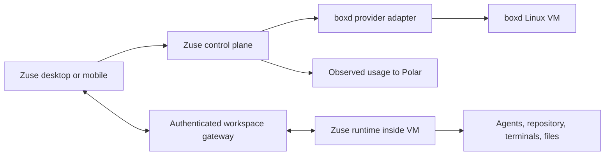

# boxd × Zuse

boxd supplies persistent Linux virtual machines. Zuse turns those machines into
coding workspaces with agents, conversations, repositories, terminals, previews,
and recovery that continue independently of the desktop app. Choose **Cloud ·
boxd** to use the same Zuse workflow on boxd compute.

This guide covers the integration shipped in **Zuse 0.23.0**, checked against
source commit `6a0c34d4` on September 30, 2026. Platform capabilities are attributed
to boxd's documentation; Zuse support is based on this repository. Checked-in
production settings and historical rollout records are not a fresh audit of the
live service.

## What boxd provides

These are boxd platform features, not a promise that every control is exposed in
Zuse. Platform documentation and rates were checked on September 30, 2026.

| Platform feature | What it does |
| --- | --- |
| Linux machines | KVM virtual machines with Ubuntu 24.04, root, systemd, and SSH. The documented default is 2 vCPU, 8 GiB RAM, and a 100 GB copy-on-write disk. Zuse advertises its own CPU/RAM presets below. [Machines](https://boxd.sh/), [resources](https://docs.boxd.sh/guides/resources) |
| Docker | Docker Engine, Compose, and Buildx are preinstalled. Container state follows the surrounding VM when it is captured or forked. [Docker guide](https://docs.boxd.sh/guides/run-docker) |
| Persistence and sleep | Disconnecting does not terminate processes. Standby keeps memory in RAM; hibernation writes it to disk. Inbound network traffic governs the platform idle timer; CPU activity alone does not prevent sleep. [Lifecycle](https://docs.boxd.sh/guides/suspend-resume) |
| Forks | Create an independent machine with copied disk, memory, and processes. boxd advertises under 200 ms for its fork operation; Zuse performs additional preparation. [Forks](https://docs.boxd.sh/guides/fork) |
| Snapshots | Save a reusable named machine state and create new machines from it later. Snapshots survive deletion of their source. [Snapshots](https://docs.boxd.sh/guides/snapshots) |
| Checkpoints | Revert the same machine's memory and disk in place, keeping its identity. Changes after the checkpoint are discarded. [Checkpoints](https://docs.boxd.sh/guides/checkpoints) |
| Domains and networking | HTTPS endpoints and named proxies route to app ports. Custom domains can target a machine or an organisation wildcard; raw protocols use separate TCP/UDP forwarding. [Proxies](https://docs.boxd.sh/guides/proxies), [domains](https://docs.boxd.sh/guides/custom-domains) |
| Integrations | Personal and organisation-shared GitHub, Linear, and Slack connections support platform integrations and automations. Isolated machines have no platform integrations or `run` CLI. [Connections](https://docs.boxd.sh/guides/integrations/connections), [automations](https://docs.boxd.sh/guides/integrations/overview) |
| Environment variables and secrets | Organisation-managed configuration with shared/private/all scopes. Isolated machines receive these values in exec/SSH sessions, not at boot. Zuse does not expose this as its own secret-management feature. [Environment and secrets](https://docs.boxd.sh/guides/env-secrets) |
| Programmable control | CLI, API keys, gRPC API, and SDKs automate machine lifecycle and platform resources. Zuse uses the TypeScript SDK's `/web` entry in its adapter. [TypeScript SDK](https://docs.boxd.sh/reference/typescript-sdk) |
| Self-hosting | A commercial self-hosted/BYOC offering for customer infrastructure. Zuse's operator-level `BOXD_BASE_URL` supports a different cluster endpoint; this is not an end-user setup wizard. [Platform offering](https://boxd.sh/pricing/), [adapter configuration](../../infra/api/src/sandbox-provider-modules/boxd.ts) |

boxd's homepage also advertises MCP installation into Claude Code, Codex, and
opencode. Its current integration guides focus on `run` and `@boxd/run`. Neither
claim means boxd integrations are automatically available to Zuse agents:
Zuse provisions isolated machines and supplies its own credential flow.
[Homepage](https://boxd.sh/), [connection scopes](https://docs.boxd.sh/guides/integrations/connections).

The platform's published rate card is credit-based, billed per second, excluding
VAT:

| Resource | boxd rate | Charged while |
| --- | --- | --- |
| CPU | €0.049 per vCPU-hour | Running, for the allocated vCPU count |
| RAM | €0.015 per GiB-hour | Running or standby, for resident RAM |
| Disk | €0.0001 per GiB-hour | Every state, for written disk |

A hibernated machine still has disk charges; standby also retains RAM charges.
These are boxd's direct prices, not Zuse's subscription or overage rates. Check
[boxd pricing](https://boxd.sh/pricing/) before quoting costs.

## What works today

| Capability | Zuse support |
| --- | --- |
| Provider selection | Choose **Cloud · boxd** in the composer's Run on menu, or request `providerId: "boxd"` through the cloud workspace API. Availability depends on deployment configuration and account access. |
| Machine sizes | Small: 1 vCPU / 4 GB; Standard: 2 vCPU / 8 GB; Large: 4 vCPU / 16 GB. Standard is the configured default. |
| Account images | Build a boxd image containing your selected repositories through Cloud Workspace settings; inspect provider-specific build status and logs. |
| Persistent work | Accepted agent turns run independently of the client. Ordinary hibernate/wake preserves machine memory and processes. |
| Conversation forks | **Fork in new tab** shares the machine. **Fork in new machine** clones the machine and opens an independent chat at the selected conversation point. |
| Previews | Opt-in public HTTPS URLs, verified HTTP port discovery, explicit ports, copy/open actions, and independent local forwarding. |
| Remote development | Cloud terminals, SSH access, files, Git, attachments, queued messages, and a local file mirror use Zuse's shared cloud infrastructure. |
| Usage visibility | Observed workspace and image-build runtime can be exported to Polar. This is informational usage, not settled boxd cost. |
| Snapshots | Used internally for base templates and account images. There is no user-facing arbitrary workspace snapshot/restore UI. |
| Checkpoints | No boxd machine rollback control in Zuse. Zuse transcript checkpoints are a different feature. |
| Domains | Named proxies use the machine's active organisation domain, including `boxd.zuse.sh`. There is no per-user custom-domain management UI. |
| boxd integrations and organisation secrets | Not exposed as Zuse configuration. Zuse uses its own GitHub and agent credential flows. |

The implementation sources are the [provider adapter](../../packages/sandbox-providers/src/boxd.ts),
[provider picker](../../apps/renderer/src/components/composer/computer-picker.tsx),
[image selector](../../apps/renderer/src/components/settings/cloud-image-providers.tsx),
[fork destinations](../../apps/renderer/src/lib/session-fork.ts), and
[cloud workspace API](../../infra/api/src/cloud-workspace-routes.ts).

## Start a workspace

1. Sign in to Zuse and activate Cloud Workspace access. Connect GitHub and your
   coding-agent credentials through the cloud onboarding flow.
2. In **Settings → Cloud Workspace**, select **boxd** under Machine provider,
   choose repositories, and build its account image. boxd is marked recommended;
   image status and logs belong to the selected provider. An E2B or Boat image
   cannot be reused as a boxd image.
3. In the composer, open **Run on**, choose **Cloud · boxd**, select a size and
   repository/branch, then send a message.
4. Zuse allocates a machine from the prepared image, prepares the repository,
   authenticates its runtime, and starts the agent. Returning to the chat later
   loads cached history before reconnecting or waking compute when needed.
5. Use the cloud terminal and workspace actions for SSH, Git, files, and previews.
   Open **Ports and previews** to enable public URLs or local forwarding.

The [cloud user guide](user-guide.md) covers access, message delivery, archives,
and reconnect behavior. The [file-sync guide](file-sync.md) explains the local
mirror: it is remote-authoritative, not two-way sync. Local edits to managed
files can be overwritten. Dependencies and ignored outputs are not normally
copied between machines.

## How boxd and Zuse fit together

Zuse owns the account, workspace lifecycle, authorization, conversation identity,
and agent experience. boxd owns the virtual machine and its native lifecycle.
The runtime's SQLite database remains the writable authority for conversations
and commands. Cached transcripts let a client display history without waking
compute; they are not a replacement VM or a writable recovery database.
See [cloud architecture](architecture.md) for the shared control and data paths.

A machine image is a reusable starting environment. A new-machine conversation
fork copies a particular running workspace. A Zuse transcript checkpoint is an
encrypted read-only conversation projection. A boxd checkpoint rolls back VM
state. These operations are not interchangeable.

## Persistence and idle behavior

Closing Zuse does not stop an accepted agent turn. Zuse's idle policy tracks
explicit user actions and active agent turns; passive polling, heartbeats, and
subscription responses do not keep an otherwise idle workspace running.
boxd also has its own network-activity-based auto-hibernation timer. The two
policies must not be reduced to "any network traffic keeps Zuse awake forever."
See the [activity classifier](../../apps/server/src/api/cloud-workspace-activity.ts)
and the provider lifecycle details below.

Normal hibernation preserves memory and processes; a cold stop, resize, crash,
or incompatible runtime can require a restart instead. VM wake latency is only
one part of reconnecting an agent workspace. The [September 28 rollout](deployments/2026-09-28-boxd-production.md)
measured a 2.33-second adapter resume in one live test; it is not a general SLA.
Public preview traffic can wake a hibernated machine, so pause does not make a
shared preview private. Disable the public route and wait for confirmed cleanup.

## Usage, billing, and availability

There are three separate concepts:

- **boxd platform charges:** the operator pays boxd according to its own pricing.
  Hibernation stops active compute charges, but stored disk is not free.
- **Zuse usage reporting:** `zuse_cloud_runtime_observed_ms` records durations
  between consecutive running observations for workspaces and image builds.
  It excludes uncertain gaps and can miss short runs. It is not exact runtime
  accounting or an invoice reconstruction.
- **Zuse customer cost settlement:** the integration has no reliable attributable
  boxd cost feed. Reservations are not finalized as boxd charges, and boxd remains
  excluded from placement when cloud billing enforcement is enabled. This does
  not remove the Cloud Workspace access/subscription requirement.

The checked-in [production configuration](../../infra/api/wrangler.production.jsonc)
enables the boxd adapter and usage export, while billing enforcement and invoice
export remain disabled. Confirmed provider-cost events and customer overage
charges are separate from runtime observations. Organisation credit balances or
approximate pending amounts cannot be safely assigned to individual workspaces.
The [billing guide](billing.md#usage-visibility-independent-of-invoices) is the
source of truth for event names, flags, metering, and settlement requirements.

## Useful workflows and remaining possibilities

Today you can run a coding task while your laptop is closed, reconnect to its
conversation, inspect its cloud terminal, share an opt-in development preview,
and fork the workspace to explore another solution with the same files and
conversation context. Independent machine forks let work diverge without sharing
a filesystem; new-tab forks still share one machine.

boxd also presents per-PR previews, personal assistants, untrusted-code execution,
per-user SaaS machines, reproducible RL environments, and agent swarms as platform
use cases. Zuse's adapter does not by itself provide automatic PR provisioning,
a swarm scheduler, an RL environment manager, or an always-on service guarantee.
Its current idle policy still applies.

Potential follow-up work includes user-managed snapshots and in-place rollback,
custom-domain controls, organisation integration/secret management, and reliable
cost settlement. These are capability gaps or product ideas, not committed
roadmap dates. Machine forks and organisation-domain preview URLs are already
implemented and should not be described as "in progress."

## Operator setup

The adapter is registered beside Boat and E2B. Its enable flag defaults off
when absent; the checked-in production configuration explicitly enables it.
The [September 28 deployment record](deployments/2026-09-28-boxd-production.md)
captures the original rollout and its verification limits. The implementation
lives in the [adapter](../../packages/sandbox-providers/src/boxd.ts) and
[API provider module](../../infra/api/src/sandbox-provider-modules/boxd.ts).

1. Publish a base template: `BOXD_API_KEY=... BOXD_ORG=<org>
   infra/cloud-sandboxes/boxd-publish.sh <version>` (see the
   [template README](../../infra/cloud-sandboxes/README.md#boxd-template)).
2. Set the `BOXD_API_KEY` Worker secret (`bun --filter @zuse/api secret:boxd`,
   `secret:boxd:production` for production). Mint the key with
   `boxd auth keys create zuse-api --org <org>`; keys are fenced to one
   organization, and every machine and snapshot lands there.
3. Set `BOXD_TEMPLATE_SNAPSHOT`, `BOXD_TEMPLATE_VERSION`, `BOXD_MACHINE_SIZE`
   (`small` | `default` | `large`) and, for an org-fenced key, `BOXD_ORG` in the
   wrangler configuration, then `BOXD_ADAPTER_ENABLED=true`. Optional:
   `BOXD_BASE_URL` for a self-hosted cluster (HTTPS, gRPC-web port).
   A deployment without E2B must also set `CLOUD_AUTH_PROVIDER_ID=boxd`: the
   account login authority defaults to E2B, and every agent connection in
   Cloud settings runs there. The value must name an enabled adapter; the
   worker refuses to boot and the production deploy guard refuses to deploy
   otherwise. It applies to authorities created from then on: an account's
   existing authority stays on the provider that hosts it, and if that
   provider is no longer registered, Cloud authentication reports
   `cloud_auth_provider_unavailable` for the account until it is registered
   again or the account reconnects on the new provider. On boxd the authority
   is an ordinary isolated machine from the base template; account images
   are never seeded from its snapshot, so credentials reach workspaces
   through the brokers.
4. Rebuild account images for boxd from Cloud settings; provider snapshots are
   never interchangeable.

The production deploy script refuses to deploy with the adapter enabled and
the snapshot, version, or `BOXD_API_KEY` secret missing, or cloud billing
enforcement enabled. Runtime placement also excludes boxd while billing is enforced.

When `BOXD_ORG` is set, the publisher creates a shared organization template so
another identity in that organization can restore it. Without an explicit org,
publish with the same API key owner used by the Worker.

## Behaviour that differs from Boat and E2B

- Pause hibernates the machine (memory written to disk) and resume wakes it
  with the runtime and agent processes intact, so workspaces
  take the warm reconnect path like E2B. A machine woken by inbound traffic
  before the api asks is treated as resumed; a pause that does not park the
  machine (traffic woke it straight back, or it was still booting) is reported
  as retryable rather than recorded. A machine stopped from the boxd console
  boots cold on resume and reaches the runtime through the fenced restart
  after the warm reconnect window.
- Workspaces get an idle timer: hibernate after `keepAliveTimeoutSeconds`
  without inbound network activity. That includes incoming packets on the
  runtime's outbound gateway connection. Active Zuse agent turns also have a
  shared keepalive path, independent of whether the desktop is open, and the
  provider's idle clock restarts on wake. Arbitrary network-silent background
  processes are not an always-on guarantee; CPU activity alone does not reset
  boxd's timer. The reconciler's own
  idle pause still runs first. Zuse refreshes that deadline for explicit user
  actions and active agent turns, not RPC heartbeats, read polling, or passive
  subscription responses. Leaving an idle chat connected therefore does not
  count as continued work. Build sandboxes get boxd's destroy timer
  instead, which counts `createTimeoutSeconds` from the machine's start
  regardless of activity: a build that outlives the deadline is destroyed.
- Every machine is isolated (no in-VM boxd CLI, integrations, or peers). Egress
  is open; restricted policies are rejected like Boat.
- A restore keeps its snapshot's size. Choosing another placement in the
  composer costs one cold reboot at creation (about 3 s); resuming never
  resizes unless the placement changed.
- Enrollment has a ten-second budget after allocation, and a machine restored
  from the image snapshot is slow for its first seconds. The adapter primes
  the runtime (`zuse --version` as `zuse` plus one transient unit) inside
  `allocate` and cold-boot resumes, ahead of that budget; the first real starts
  without it missed the window by under a second and only succeeded through
  the reconciler's automatic restart.
- Preview and SSH endpoints use named proxies. The adapter constructs URLs from
  the machine's active `access.domain`, for example
  `https://p3000.<machine>.boxd.zuse.sh`, rather than trusting a stale
  cluster-domain value in proxy listings.
  The runtime port's route is part of the template so DNS exists before the
  first connection; a new preview port resolves immediately under the
  machine's wildcard. Traffic to a proxy reaches the VM interface, so the
  adapter runs the shared loopback forwarder on every endpoint resolution.
  The renderer discovers listening ports while a ready Boxd chat or its
  browser preview is active, publishes verified HTTP ports 1024 and above only after the user enables auto-creation,
  and shows their URLs in the browser's server list and the
  dedicated Ports and previews menu in the top bar. Both menus support copying preview URLs. The toolbar's server
  button returns to that list to switch ports or copy a link. Opening a Boxd
  preview uses its HTTPS URL when auto-creation is enabled; otherwise it opens
  a local SSH forward. Other
  providers retain their existing SSH preview behavior. Chat and browser
  share one poller per workspace; successful routes are reused, failures
  retry independently, and discovery backs off while disconnected. Polling
  stops when neither surface is active or the workspace is no longer ready.
  These are public URLs: anyone with a link can reach the server. Pausing
  does not revoke a Boxd link, because inbound proxy traffic can wake the VM.
- There is no attributable actual-cost settlement feed wired into Zuse. Machine
  records carry only `createdAt` and `hibernatedAt`, so no actual-cost settlement
  source exists for boxd: reservations are made at the price schedule while
  a run lasts, but nothing finalizes them. boxd placements are unbilled until
  boxd exposes attributable usage. Runtime observations are independently
  exported to Polar as `zuse_cloud_runtime_observed_ms` when
  `CLOUD_USAGE_EXPORT_ENABLED=true`; they are sampled activity, not exact costs.
  See [usage operations](billing.md#usage-visibility-independent-of-invoices); keep the adapter off where cloud billing is
  enforced (`CLOUD_BILLING_ENFORCEMENT_ENABLED`).
- The 50 concurrent machine cap per organization counts hibernated machines
  and forks. Deleted workspaces free their slot; snapshots do not count.

## How conversation forks work

Boxd workspaces expose **Fork in new tab** (same machine) and **Fork in
new machine** (new chat and machine). Other cloud providers do not expose
these actions. Local tab/worktree behavior is unchanged.

The desktop uses a dedicated `cloud.workspaces.fork` RPC and
`POST /v1/cloud/workspaces/fork` endpoint. Older desktop servers and hosted
APIs reject this operation instead of dropping fork metadata and creating an
empty image restore. Deploy the API and compatible runtime before enabling
the action in a desktop build.

A local preview of the selected conversation is staged before opening the new
chat and persisted in the existing timeline cache. It contains no inherited
running turn, queue, or interaction state; the authoritative child checkpoint
replaces it when available.

Machine forks use the native SDK `machines.fork`, preserving the machine's
disk and memory rather than restoring the project image. The SDK documents
that native forks inherit the source egress allowlist. The lifecycle owner
leases the source and persists a network-recovery intent, briefly applies a
host-enforced quarantine, forks, and restores the parent's networking.
A reconciler restores it if the worker disappears. Snapshot restores cannot
use this mechanism because they do not inherit the allowlist. The parent can
briefly lose outbound connectivity during quarantine; its identity and files
remain unchanged.

boxd's advertised fork time measures the platform operation. Zuse additionally
waits for quarantine propagation (currently 1.1 seconds), prepares the child,
imports the conversation, and reconnects. Do not promise a sub-200 ms Zuse fork
or that a managed agent continues its copied in-flight turn in the child.

Within the quarantined child, the copied Zuse runtime and its managed agent
processes are stopped and restarted with a fresh workspace identity. Other
machine processes retain their cloned memory. The complete stopped database
directory (including WAL) is verified and retained under
`/var/lib/zuse/fork-source/<new-workspace-id>/user-data`; copied queues are
never attached as the child's live database. The selected conversation through
the fork point is imported using the shared transcript-fork behavior, including
native provider continuation where supported. Stable import IDs make retries
idempotent. Provider session files, attachments, local commits, staged changes,
and untracked files remain available. The new branch starts at captured HEAD.

The source runtime must advertise `machine-fork-v1`; older runtimes need an
update before machine forking. Enrollment uses the existing bootstrap flow
with a fresh token, transcript key, gateway fence, and SSH identity.
This implements the identity isolation described in
[fork identity ADR 0033](../../specs/cloud-platform/decisions/0033-fork-identity.md),
with the current storage behavior described in its implementation note.
See the installed SDK README or
[SDK documentation](https://www.npmjs.com/package/@boxd-sh/sdk).

## Implementation and test references

| Area | Source and regression coverage |
| --- | --- |
| VM allocation, hibernate/wake, proxies, native forks | [Adapter](../../packages/sandbox-providers/src/boxd.ts), [unit tests](../../packages/sandbox-providers/test/unit/boxd.test.ts), [live lifecycle test](../../packages/sandbox-providers/test/live/boxd.live.test.ts) |
| Fork ownership, isolation, and recovery | [Lifecycle coordination](../../infra/api/src/cloud-workspace-fork.ts), [ownership tests](../../infra/api/test/unit/cloud-workspace-fork.test.ts), [fork preparation tests](../../infra/api/test/unit/cloud-workspace-fork-prepare.test.ts) |
| Preview discovery and revocation | [Discovery](../../apps/renderer/src/lib/preview-discovery.ts), [publication lifecycle](../../apps/renderer/src/lib/preview-publication.ts), [regression tests](../../apps/renderer/test/unit/preview-publication.test.ts) |
| Idle policy | [Activity classifier](../../apps/server/src/api/cloud-workspace-activity.ts), [tests](../../apps/server/test/unit/cloud-workspace-activity.test.ts) |
| Usage reporting | [Usage service](../../infra/api/src/cloud-usage.ts), [runtime usage tests](../../infra/api/test/unit/cloud-runtime-usage.test.ts), [billing operations](billing.md) |

## Provider verification

- Unit: `bun --filter @zuse/sandbox-providers test:unit` (fake SDK client) and
  `bun --filter @zuse/api test:unit`.
- Live: `BOXD_API_KEY=... BOXD_ORG=<org> BOXD_TEMPLATE_SNAPSHOT=zuse-base-v<N>
  bun --filter @zuse/sandbox-providers test:live` creates a machine from the
  template, runs the installed CLI as `zuse`, serves HTTP and a WebSocket echo
  through a named proxy, round-trips a file, hibernates and wakes with the
  tagged process intact, replaces it through the fenced restart path,
  snapshots, forks from the snapshot, and deletes everything it made.

## Incident investigation

Use the [shared incident debugging runbook](incident-debugging.md), including its
Boxd-specific access and lifecycle notes. The memory/recovery checks are shared;
Boat API endpoints and snapshot-file procedures are not interchangeable with Boxd.

Preview auto-publication requires `isWebServer: true` from the runtime. Discovery excludes the runtime process’s own Linux sockets and probes HTTP with bounded HEAD requests, so SSH and other non-HTTP services are not published. Older runtimes without this verification field do not auto-publish; update the cloud runtime to enable discovery.

The Ports and previews menu independently enables public URL auto-creation and local forwarding. Both default off and are remembered per workspace across renderer restarts. Users can explicitly add a port (for example 3001) even when older runtimes cannot verify it; unverified ports are never auto-selected. Turning local forwarding off releases only preview-owned tunnels, including pending opens; tunnels borrowed by another feature remain open. Turning URL auto-creation off revokes issued provider routes and verifies their removal. Publication and cleanup are serialized so an in-flight response cannot escape revocation. The last discovery consumer also triggers cleanup. A durable journal is written before publication and reconciled after renderer restart. Failed revocation remains visibly pending and retries; it must not be presented as a successful switch-off. Cleanup includes legacy `p<port>` routes and pinned default preview routes, but preserves the runtime route. Named routes managed outside Zuse are not adopted for new previews. Provider failures or abrupt app termination can delay deletion; URLs are not time-limited leases, and pending removal means previously shared links may still be public.

Preview bridges use `--preview`: they refuse to bind before the loopback app starts and exit when that app stops (checked every 500 ms with a bounded probe). This releases the VM interface port for the next wildcard-bound dev server. The runtime bridge on 47837 remains persistent so bootstrap and reconnect behavior are unchanged. Existing bridges created by older API builds must be removed after verifying their process identity; deploying the adapter change governs future bridges.

Deploy the API revocation handler before releasing the renderer/native changes.
An older API or a provider that refuses deletion must produce pending cleanup,
not a successful off state. Default-route deletion support is provider-dependent;
the adapter verifies that the hostname is absent after deletion and never falls
back to auto-detection or a different port to simulate revocation.
