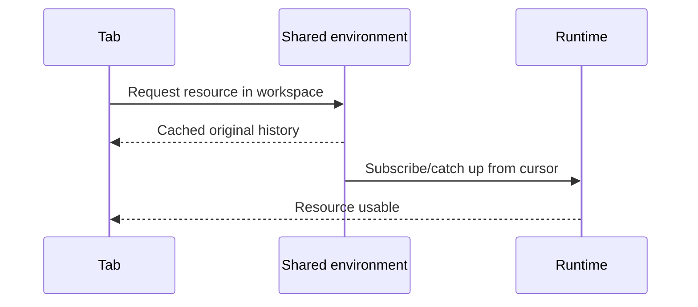
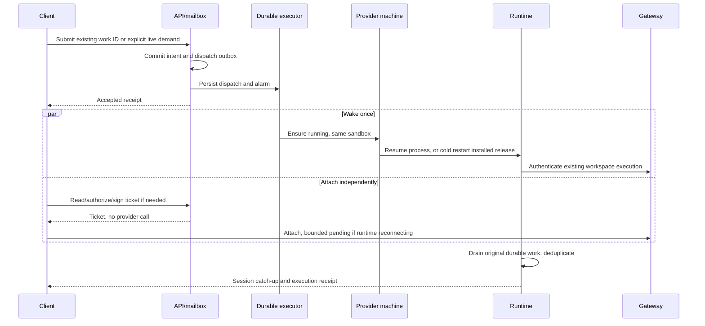
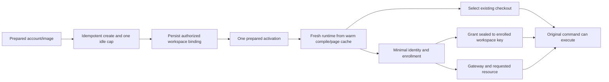

# Cloud runtime architecture plan

Status: implementation in this branch, October 10, 2026; live rollout gates remain open. No production deployment or demonstrated latency/SLO claim. Provider names below are Boxd, Boat and E2B; the legacy `box` adapter is not assumed equivalent to Boxd.

## Product contract

- Every provider gets the same data preservation, work delivery, authentication, cancellation, update and reconnect guarantees. Native disk/region outages still affect availability; none permits silent data replacement.
- Boxd targets **under five seconds from user action to usable original chat and selected agent able to execute accepted work**, for both new workspace creation and wake. First model output is measured separately. Every attempt over five seconds is a target miss; percentiles do not erase misses.
- Boat and E2B use the same correctness protocol with provider-specific startup timings. Their cold boots do not justify weaker recovery or lost work. Publish their actual timings separately, without imposing the Boxd speed promise.
- Sleep when idle. Reading cached history does not wake compute. Opening a live shell, starting a conversation tab that requires runtime work, or submitting work creates explicit compute demand.
- Aim for application-caused visible failure rate at or below one per million logical work attempts. Count wrong-session attachment, lost/duplicated accepted work, unnecessary replacement, and visible terminal errors. Count a failure even if a later retry heals it. Report all-cause availability separately. Maintain separate denominators for creates, wakes, attachments and commands so high command volume cannot hide a failing wake path.

The implemented presentation sequence is: restore machine → authenticate the shared runtime connection → select/open the chat and accept durable prompts → display actual repository preparation progress → release agent execution. Connected and execution-ready are separate observations. A connected chat can accept a prompt while the shared workspace execution gate prevents provider startup or sends until repository and credentials prerequisites are satisfied.

Boxd acceptance clarification: ordinary allocation/wake, runtime activation, workspace authentication, attachment, and agent credential preparation together target **under five seconds**, with actual repository fetch/branch operations reported separately. Connecting early alone does not satisfy this target if credential preparation then adds a long wait. Report total request-to-agent-receipt time as well, and trace overlapping stages rather than subtracting an aggregate repository/gateway interval. Template restoration uses already-installed binaries and warm cache; same-workspace memory wake resumes its existing process. Fresh template clones initialize unique workspace identity. Runtime downloads and latest-channel checks are explicit maintenance, never ordinary startup. Account-side provider preparation should be paid before workspace creation; lazy per-turn credentials still require a measured bound and must not silently extend startup.

## Evidence and existing decisions

The recovered branch is [kadabra-bCyAzJ7Zy0eQHkfG](https://github.com/swarajbachu/zuse/tree/kadabra-bCyAzJ7Zy0eQHkfG), preserved at `1a4ab4be762146a9c16b00a71023cd7aa9f63214`. Its live tests measured create plus idle configuration at 194–422 ms, but create through an observed enrollment request at 2.209/3.809/5.997 seconds. Those samples excluded successful enrollment, gateway and agent readiness. The 5.997 second sample already misses this plan's target. The signed-manifest compatibility rebase disabled prepared activation and was not remeasured.

The same experiments rejected restored in-process application activation after independent clones produced identical RSA/Ed25519 keys. Use fresh workspace processes with prebuilt Node compile/page cache, not cloned application identity or random-generator state.

This plan retains [ADR 0001](../adr/0001-e2b-cloud-workspace-auth.md)'s on-demand allocation, account authentication ownership and API-ciphertext boundary, and [ADR 0002](../adr/0002-cloud-runtime-compatibility.md)'s in-place recovery and immutable installed-release compatibility. Amend [ADR 0002](../adr/0002-cloud-runtime-compatibility.md)'s socket-error-triggered client recovery rule: attachment errors cannot authorize replacement. Amend ADR 0001’s retained `legacy-image` recovery exception: provider auth repair must retain the existing chat/storage; a replacement chat is no longer the default. Preserve the old delivery mode until a tested in-place account-authority bridge is available. Persist workspace identity keys, the current workspace bearer and the pending renewal receipt atomically; provider grants stay process-local and reusable refresh credentials stay in the account authority. Amend the older SLO definitions to include selected-agent command readiness and to make Boxd new creation under five seconds. Removing the authority VM for static keys would change [ADR 0001](../adr/0001-e2b-cloud-workspace-auth.md)'s secret boundary; it is an explicit future decision, not silently part of this rollout.

## Minimal model and ownership

Three durable concepts:

1. **Workspace:** account, provider sandbox binding, storage incarnation, original chat/session, current authorized execution generation, and installed compatible release.
2. **Work:** stable command ID, payload fingerprint, acceptance/execution/result receipt, and cancellation. Transport delivery is disposable.
3. **Release:** immutable signed executable content, supported protocols and storage compatibility. Changing release is maintenance.

Attachment, power state and provider credential readiness are observations of these concepts, not another workspace owner. Do not derive process death from a missing socket, or disk absence from a failed boot.

| Responsibility | Existing owner to deepen | Prohibited duplication |
| --- | --- | --- |
| Accepted work/results | Existing mailbox plus runtime SQLite command receipts | New socket mutation queue that independently retries execution |
| Desired execution, generation and operation | Existing API workspace store/reconciler | Renderer/mobile restart policy or provider-specific lifecycle state machine |
| Durable dispatch | Existing WorkspaceStartup DO | HTTP waitUntil doing provider work; a second authoritative DO copy of workspace state |
| Physical connection | Existing EnvironmentRuntime/ClientBus and gateway | One connection/wake controller per tab |
| Local writer and ordered launch effects | Shared guest launcher | Independent stop/start scripts in each adapter |
| Provider credentials/refresh | Existing account authority and driver resolver | Concurrent token refresh owners per sandbox |
| Artifact transaction | Existing updater | Download/install on ordinary wake or crash recovery |

Postgres remains lifecycle authority. The startup DO stores only a dispatch pointer/revision and alarm. The gateway owns sockets, never product history. SQLite remains authoritative for existing runtime sessions and execution receipts. Reuse current transaction/lease machinery instead of creating another database.

## End-to-end paths

### Already connected tab

Zero provider calls, no wake, no enrollment, no release check. Coalesce concurrent attachment in EnvironmentRuntime. A fresh renderer still needs authorization and one physical attachment; do not add a cross-process broker merely to save that.

### Wake an existing workspace

There is no transaction spanning mailbox DO storage and PostgreSQL. For commands, extend the existing mailbox commit transaction to persist the command plus a wake-delivery marker and alarm before acceptance. Its alarm retries the same command-linked wake against the existing lifecycle owner, and clears delivery only after durable scheduling acknowledgment. The marker is delivery responsibility, not a second lifecycle authority. PostgreSQL atomically commits desired execution/demand revision plus next-due responsibility; WorkspaceStartup accepts a revision pointer and alarm. For explicit live demand without a command, that PostgreSQL commit is the durable intent. Periodic due-work scans repair a lost pointer. Do not falsely label the current reserve→wake→commit cross-store sequence atomic.

A work commit followed by a lost dispatch response is recovered from that durable delivery marker with the same ID. Do not acknowledge work as executed because it was queued. Passive attachment never wakes; explicit demand owns wake. Configuration changes/idle extension occur under that demand owner, only when necessary. Gateway attachment and selected-provider grant preparation can run concurrently once the required workspace binding/key exists. On fresh allocation, sealed grant delivery waits for enrolled identity; only account-side grant preparation may run earlier.

### Boxd new workspace

Prepare signed bytes, CLIs, repositories, scripts and cache during account/image setup. Use matching image size to avoid resize reboot on the fast path. One idempotent activation request starts the prepared path; its launcher acknowledgment is not enrollment or readiness. Successful enrollment and selected-agent execution evidence establish readiness; do not separately poll SDK-ready, execute systemd checks, prime CLI or upload unchanged scripts. Cold/imported/incompatible images take a named cold compatibility path, not a silently advertised fast path. Count that cohort's user-visible misses too.

With a manifest configured, an installed verified compatible release is still valid. Prepared activation must support it; do not disable signature verification to recover speed. Latest-channel updates occur separately.

## Provider-neutral reliability contract

Provider memory retention is a hint, never proof of a surviving process. Replace the safety meaning of `preservesProcessesOnResume` with observed resume disposition and guest ownership evidence.

The shared adapter seam needs these outcomes, implemented through the existing provider adapter rather than a parallel registry:

- `observeSandbox`: non-waking observation distinguishing running/sleeping/stopped/starting/unavailable and **verified missing**. Unknown, failed and readiness timeout are not missing.
- `ensureRunning`: idempotent desired execution using stable sandbox ID and operation ID. Return retained-memory, cold-boot or unknown disposition. No implicit allocation/deletion or unnecessary image preparation. New allocation carries a stable operation tag/idempotency key; after a lost response, locate/adopt only that operation’s machine. If provider evidence cannot establish whether allocation happened, keep the outcome unknown rather than create a second machine.
- `ensureRuntime`: shared guest launch operation with execution generation, operation ID, pinned verified release and expected storage identity. Returns already-owner/started/pending/rejected; lost response replays the same operation.
- `observeRuntime`: successful positive guest evidence of owner/process state. Unsupported or failed inspection is unknown. It never authorizes destruction.
- Explicit pause/archive/delete and existing usage evidence remain separate. Archive/delete tombstones take precedence over pending launch and delayed retries. Fence all destructive paths, including legacy cleanup, rollback and quarantined fork reset; disable unguarded APIs once a guest has guarded ownership.

Boxd can implement these through native memory wake and its managed service. Boat must restore/check its existing disk after cold boot before launch, including the existing `/srv/zuse` mount barrier and durable journal location. E2B command transport must invoke the shared guest guard before any signal or kill; envd must never independently stop then start an unguarded writer. E2B must handle both process-preserving and filesystem-only resume. The shared guest guard makes all launch-capable providers safe even if an upstream command returns after the API lease changes. Providers that cannot yet supply a guarded launch/data contract are not called equally reliable by capability declaration alone.

Never kill an existing sandbox because status is failed/error, boot is slow, account image changed, or endpoint is unavailable. A positive provider deletion/not-found result permits data-recovery evaluation; it does not permit silently substituting a blank chat. Preserve the recorded ID/data expectation and recover from a verified complete checkpoint where possible; otherwise expose a precise unavailable-data state.

## Sleep is an owned transition

The existing lifecycle owner permits sleep only when there are no accepted pending commands, active agent/tool turns, or explicit live-resource leases. Cached history and background subscriptions do not hold compute awake. Resource leases are bounded and account-scoped; a crashed client cannot prevent idle sleep forever.

Recheck the durable demand revision immediately before pause. Reconcile the actual provider acknowledgment: refusal or a lost response is not proof of sleep. Work accepted during pause advances demand and schedules wake on the same machine. Boxd's network-idle timer must not put a CPU-only tool to sleep; while work is active, the external owner maintains the provider idle allowance with bounded coalesced renewal. A sleeping guest timer cannot own its own wake. Boat's create/resume TTL is a separate provider cap, not Zuse's user-idle policy.

Guest-state locations are part of each supported image contract: Boxd/E2B retain the existing canonical data location and verified persistent activation/update paths. Boat must map the current `/var/lib/zuse-process-activations` and `/var/lib/zuse/runtime-update` state into the verified `/srv/zuse` persisted layout through a versioned mount/alias migration, before enabling guarded-launch capability. Inspect populated state first; ambiguous paths halt migration. E2B images without systemd use the same privileged launch helper and lifetime lock via envd, with explicit child-group retirement and persisted journal, not a separate process-list/kill/start implementation. Reusable images install this substrate ahead of demand; old images require a tested in-place installer.

## Runtime identity and single execution owner

Retain one workspace identity across sleep. Introduce persisted workspace signing/encryption identity for existing-machine process restart only through a versioned migration:

- Acquire the canonical data-directory lifetime lock before opening SQLite, reading identity for launch, or enrollment. One writer includes agent children; replacement must stop/verify the complete managed process tree.
- Store private keys with mode 0600 in the existing canonical state, bind them to account/workspace/provider sandbox/storage incarnation, and keep the API's current generation/revocation authoritative.
- The workspace remains the existing trust boundary: same-UID agent/tool code is not isolated from runtime secrets by file permissions alone. Do not add a resident signing service merely for this migration. The existing privileged launcher owns mutation fencing; the API restricts restart proof to the recorded workspace and already authorized operation, never allocation or generation promotion. A leaked/copied key can impersonate the original workspace until revoked; signer-asserted sandbox fields are not independent placement proof. Controlled forks must quarantine and erase copied authority before egress. Stronger isolation or provider-attested placement is a separate justified security change, not an unproven guarantee here.
- First allocation gets one bootstrap authorization. Existing-machine restart proves the persisted workspace identity against the recorded authorized launch operation; it cannot self-assign a newer generation or revive archived execution.
- Prepare candidate data/keys durably before publishing an enrollment receipt. Retry responses reproduce one committed identity, not a fresh key pair.
- Runtime generation protects actual process handoff; gateway epoch protects connection/access revocation. Neither changes merely for a network retry or successful token refresh. Do not merge them without proving equivalent semantics.
- Template capture excludes enrolled identity. Native fork is quarantined, stops copied writers, clears copied machine/identity/launch records, and generates child identity while preserving required DB/WAL/chat data. Only then permit egress and activation.
- Legacy process-ephemeral keys retain the existing signed renewal and durable bootstrap receipt until the migration passes old populated-data tests. Do not bulk restart the fleet to install identity migration.

The launch order is: take launch guard → validate and durably record authorized operation/fence → stop the old managed tree and prove exit when replacement is authorized → acquire the canonical lifetime data lock → read identity/open SQLite/enroll/start. A same-operation retry with a matching live owner returns its evidence; it does not stop it. Never wait for the old owner’s data lock before the authorized stop. API tombstones reject enrollment, leases and new authority immediately. If the guest is unreachable, an already dispatched script can still run before receiving its fence; shutdown is pending until local retirement is acknowledged. Do not claim instant remote process termination or irreversible-tool cancellation. The guest checks delivered tombstones under the launch guard; a canceled operation cannot promote execution. A launch retry must take the same guest generation guard before stop/replace; delayed old launches cannot kill a newer owner. A data lock and a launch-order guard protect different resources. Keep one of each, not several per provider.

## Authentication without execution coupling

Access credentials remain short-lived; workspace identity is durable and revocable. Renew with signed proof and one stable renewal request ID, including after sleep beyond bearer expiry. Persist/replay committed rotation receipts. Losing a response must not invalidate the client's only recoverable credential.

Typed responses must distinguish expired bearer, stale rotated bearer, temporary backend unavailability, confirmed revoked identity, stale execution generation, and required account login. Only confirmed revocation/ownership loss retires execution. A generic 401 cannot prove it. Pause network-dependent work during reauthentication and preserve chat/process state; never drop all sessions to repair a stale token.

Ticket minting is read/authorize/sign only. Remove activity writes, provider keepalive and paused-workspace reconciliation headers. Access checks remain at the real account/workspace boundary; skip redundant machine checks. A cached route/ticket is not permission to resurrect revoked access.

Reuse recovered account-authority source digests, persistent grant handler, request fingerprint cache and Boxd authenticated localhost control-channel transport. No new public authority proxy/certificate provisioning on startup. Native refresh tokens retain one owner and serialized refresh. Valid selected-provider grants are reused; refresh runs in parallel with gateway/checkout readiness. Commands needing that provider await its credential, without hiding that wait behind a green connection icon. Static-key authority elimination is a separate privacy/ADR decision; it is not required to obtain the first speed gains.

## Gateway and client semantics

Keep the existing hibernatable DO relay. Its constructor remains trivial; socket role/identity is serialized in attachments and reconstructed after hibernation. Deploy/runtime shutdown can terminate sockets; this is a transport event, not permission to replace a sandbox.

Add bounded `runtime-pending` / `runtime-available` control states to the current framing with capability negotiation. A transient same-owner runtime detach need not close every client immediately. New clients may wait while actual demand wakes the guest. Passive clients cannot trigger wake. Start with a 30-second gateway pending lifetime and bounded frame/request caps, configurable from measured load. Expiry returns a typed retryable attachment result and releases resources; durable work and its wake operation remain intact. Avoid retaining arbitrary RPC frames indefinitely: durable mutations use the mailbox; reads either wait within a bounded budget or return a typed retryable result.

Reconnect must reset local RPC transport state, resubscribe from durable cursors and reconcile pending results. A preserved outer socket alone does not preserve an inner RPC session. On execution-generation change, invalidate old transport state explicitly and recover resources against the new owner. Scope/access revocation closes affected clients immediately.

Old clients/runtimes retain current framing until upgrade; negotiate controls rather than broadcasting unknown frames. The compatibility bridge handles ordinary disconnect/reconnect with preserved logical sessions. UI state derives from work/attachment facts: sleeping, waking, synchronizing, usable, or a specific actionable prerequisite. Automatic transitions are not terminal connection-error banners. Genuine revocation/data loss is not hidden.

Remove serial GET→resume→500ms poll→ticket→handshake→folder-list from the normal critical path. Runtime handshake or first requested-resource response can supply cached/validated workspace root and capabilities. Retain a legacy negotiated fallback. Reset stale reconnect delays on actual wake/online indications, without restarting the process or minting another wake intent.

## Durable execution and release updates

WorkspaceStartup executes due work until the authoritative operation is complete or explicitly waiting on a prerequisite. Re-arm its alarm at the authoritative next due time if reconciliation returns after an observation window. Keep the DO dispatch revision to avoid losing concurrent requests. A successful callback or idle activity cannot postpone unfinished launch/update work to the idle deadline. The reconciler returns an exhaustive scheduling outcome: complete, due-at timestamp, or blocked on a named prerequisite with wake source/deadline. Credential/account events reschedule blocked work; missing guest evidence has a bounded next observation. The DO persists/re-arms its pointer from this outcome. Maintenance scans repair missed dispatch; they are not the normal completion path.

Separate `restart-installed-runtime` from `change-release`. The current uncommitted transactional updater path must not run for every process restart merely because manifest configuration exists.

For a real update: prepare/download/verify while current owner remains authorized; retain signed previous bytes; checkpoint SQLite/WAL and required provider-session state; commit one authorized handoff; launch against the same data; confirm the exact version/generation and original session head; then confirm the journal. Rollback uses retained signed bytes and fresh execution authority, never a spent boot token. Failures keep the original disk and actionable per-operation phase/exit diagnostics.

The API owns desired operation and execution authority; the guest updater owns artifact mutation/journal. Correlate one operation ID and observe a result, rather than expose a cross-product of duplicate phase clocks. Use one persisted operation deadline, initially 120 seconds for ordinary launch/verification, and a separate explicitly sized deadline for artifact preparation. Provider calls have bounded attempts within that deadline. After expiry, record a bounded verification-needed/unavailable result and a scheduled recovery policy; accepted work remains durable and no disk/process replacement is inferred. Confirming-offline cannot poll indefinitely. Healthy confirmation response loss is a journal-ack retry, not reason to kill a serving runtime.

Legacy unsigned previous releases cannot be called verified rollback targets. Install/capture a verified baseline before enabling rollback; preserve old runtime until preparation succeeds. Protocol/storage-incompatible migrations need their own tested reversible plan. API release order keeps older runtime protocols available until telemetry proves migration complete.

## Boxd latency budget

Budgets below are allocations to validate, not measured capabilities. The five-second contract includes ticket authorization, resource/session catch-up and selected-agent readiness. Do not move a delay outside the measurement by relabeling it.

| Stage | Existing workspace wake budget | New prepared workspace budget |
| --- | ---: | ---: |
| Account authorization, durable intent and dispatch | 300ms | 300ms |
| Native wake, or create plus idle cap | 500ms | 500ms |
| Prepared activation acknowledgment | Not needed | 500ms |
| Existing runtime reattach, or fresh process/enrollment | 700ms | 1500ms |
| Selected grant, checkout and client ticket in parallel | 700ms envelope | 1000ms envelope |
| Resource catch-up, selected-agent protocol handshake and execution-ready receipt | 300ms | 300ms |
| Tail headroom | 2500ms | 900ms |
| End-to-end budget | 5000ms | 5000ms |

Execution readiness requires the selected driver/process to accept the actual test command through its protocol and demonstrate start/progress; a queued receipt or local ready flag is insufficient. Avoid summing cumulative milestone timestamps. Trace overlapping spans and actual critical path. Cached tab target: requested resource usable under 500 ms, with immediate cached history. Account setup/image builds are explicit prerequisites; if startup triggers their repair, record the user's full wait and target miss as well as a separate cohort. No speculative warm machine pool, permanent warm workspaces or TLS-verification bypass.

## Failure contract and validation gates

| Injection | Required result on every provider |
| --- | --- |
| Socket loss with alive guest | Original process/data/generation unchanged; logical session catches up |
| Sleep beyond credential expiry | Same identity renews; no new workspace/enrollment loop |
| Memory absent after resume | Installed runtime safely restarts on original disk |
| Lost wake/launch/enrollment/renewal response | Same operation/receipt replay; no new paid work or competing writer |
| Delayed old launch | Rejected before it can stop the newer process |
| Concurrent tabs/windows/work | One coalesced wake and shared attachment; each work ID retains result |
| Runtime crash during command | Recover committed receipt/provider session; uncertain upstream outcome is explicit, never blind duplicate execution |
| Update interrupted in every phase | Original data retained, exact-version confirmation or verified rollback |
| API/DO restart or deployment | Durable dispatch re-arms; socket subscriptions recover from cursors |
| Failed/slow/unknown provider status | No deletion or blank replacement; precise pending/unavailable diagnosis |
| Boat disk not mounted yet | Wait through existing disk-readiness seam; no empty database creation |
| Cancel/archive/delete races wake | No fresh authority or accepted command execution after the tombstone; guest stop has separate verified acknowledgment |
| Native fork/template | Original data required by fork retained; child identity unique, copied owner disabled |
| Corrupt/absent authoritative DB/WAL | Preserve evidence/backups; no automatic initialize/reset |
| Auth revocation | Access denied promptly; workspace data preserved |
| Model/OAuth service outage | Accepted work remains durable; selected driver prerequisite reported precisely |

Durable local command receipts give idempotent acceptance, not magical exactly-once external effects. If a model/tool accepts work before local completion is recorded, use its native session/receipt recovery where supported; otherwise preserve `outcome-unknown` and do not automatically resend. Document this case in the shared driver contract.

Tests comprise: shared provider conformance; real guest-process writer/launch ordering tests; real local PostgreSQL lease/outbox/receipt concurrency; property-based/randomized interruption traces; gateway hibernation/control compatibility; old populated DB/WAL plus provider-session upgrade/fork fixtures; signed updater phase interruption; and disposable live-provider suites. All three providers must pass the same identity/data/work assertions before rollout.

Boxd live measurement uses current API/runtime with signed manifests enabled, no guest diagnostic exec in the timed wake path, real desktop-origin spans, and original session/command IDs. Test short sleep, long expired-auth sleep, process death, new creation, first authority setup, repeated grants, multiple tabs and simultaneous workspaces. Report sample count, p50/p95/p99/max, every >5 second miss, outbound request counts, provider-native timing separately, and actual command acceptance. Three fast samples or enrollment-only probes cannot certify the goal.

To evaluate a one-per-million target, combine known-fault coverage, randomized interruption runs and production telemetry. Roughly three million independent zero-failure trials yield only an idealized one-sided 95% upper bound near that rate; correlated deploy/region failures need explicit fault tests. Never claim the rate from current green unit tests.

## Delivery sequence and acceptance

For pre-migration runtimes, cold recovery uses a fresh API-authorized generation and durable sealed bootstrap receipt bound to the existing workspace/storage. Consumed old tokens are never reused. This is the compatibility bridge until persisted proof is installed; a supported restart is not implicit self-enrollment. Full universal reliability is claimed only after each provider passes guarded-launch and migration gates.

1. **Shared correctness foundations:** provider missing/error classification and no-delete-on-boot-error; shared guarded launch/data identity; durable dispatch through completion; typed auth retirement; preserve existing populated sandboxes. Gate on all-provider conformance and actual DB concurrency.
2. **Cut ordinary-path dependencies:** passive tickets, explicit coalesced demand, installed-release restart, warm-vs-cold disposition, bounded pending attachment and resource catch-up. Gate on zero provider calls for ready attachment and no installation/enrollment on preserved wake.
3. **Boxd prepared speed:** integrate recovered code by behavior, not a wholesale cherry-pick of old source; retain current provider/billing/fork logic. Make signed installed releases compatible with prepared activation. Gate on key uniqueness, old-image fallback and end-to-end under-five traces.
4. **Persisted workspace identity:** versioned per-workspace migration, clone/fork sanitation and authoritative revocation. Keep legacy bridge until proven; no fleet-wide restart. Gate on expiry/crash/replay/migration cases.
5. **Isolated release maintenance:** finish scoped updater/journal confirmation/rollback and immutable artifact retention. Gate on interrupted updates of old populated workspaces and compatible current/previous client protocols.
6. **Staging then controlled rollout:** deploy backward-compatible API/runtime, test new and existing workspaces on each provider, publish compatible images for new workspaces, then opt in by provider/capability. Existing data is never recreated. Keep a kill switch for fast prepared activation that falls back to retained installed release, not image rebuild.

Apply checks and evidence to each slice. Keep changes small enough to review; do not present the current broad uncommitted prototype as the finished architecture. Deployment follows implementation and the stated validation gates. Current PR and prototype coverage are input, not proof of this new plan.

## Implementation seams

- API: `cloud-workspace-reconciler.ts`, `cloud-workspace-routes.ts`, `cloud-workspace-store.ts`, `cloud-mailbox-coordinator.ts`, `workspace-startup.ts`, `workspace-gateway.ts`.
- Shared attachment: `packages/client-runtime/src/environment-runtime.ts`; renderer/mobile adapters keep provider logic out of UI.
- Providers: `packages/sandbox-providers/src/index.ts` and provider adapters; shared guest guard/launcher, not three restart implementations.
- Runtime: `apps/server/src/api/cloud-workspace-runtime.ts`, selected-provider resolver, SessionDomain/SQLite receipt and outcome recovery.
- Artifacts/images: existing runtime updater plus cloud-sandbox provisioning/prepare/sanitization and recovered compile-cache activation.
- Billing: existing usage ledger/outbox, stable account/workspace/sandbox attribution and execution boundaries. Coalescing wake must not duplicate billed activity; paused/unknown observations do not become running charges.

## Sources and research limits

Primary local evidence: recovered startup notes/live record, original private conversation, actual current adapter/gateway/auth/reconciler source, ADR0001/0002 and runtime-data-recovery runbook. Root and independent architecture/provider/test reviews informed this plan. The final external architecture review completed after the earlier session-limit interruption; its required changes informed wake detection, pending attachment admission, persisted renewal state, removal of the prepared activation listener, and separation of restart from update.

Official references: [Boxd memory sleep/restore](https://docs.boxd.sh/guides/suspend-resume), [Cloudflare hibernatable WebSockets](https://developers.cloudflare.com/durable-objects/best-practices/websockets/), [DO shutdown behavior](https://developers.cloudflare.com/durable-objects/concepts/durable-object-lifecycle/), [execution limits](https://developers.cloudflare.com/durable-objects/platform/limits/), [Node compile cache](https://nodejs.org/api/module.html#module-compile-cache), [E2B persistence and disk-only fallback](https://docs.e2b.dev/sandbox/persistence), [E2B filesystem-only snapshots](https://docs.e2b.dev/sandbox/filesystem-only-snapshots), [Boat storage/process lifecycle](https://docs.boat.dev/faq). Provider-specific resume evidence and baseline test results are recorded in [the validation plan](runtime-architecture-validation.md); the implementation and remaining live gates are recorded below.

## Implemented branch behavior

- All providers share guarded launch operations. An unknown provider result preserves the existing sandbox; it does not authorize deletion or a fresh disk. E2B uses a process supervisor with retirement evidence instead of relying on an execution-start ACK.
- Boxd preserved wake is provider wake/resume only: no guest preparation, priming, SDK readiness probe or release installation. Image publication primes systemd and the Node compile cache without capturing workspace identity.
- Initial launch and cold recovery use the canonical data directory's inherited lifetime lock. Conflicting populated databases, a missing expected database or an unaccounted writer stop activation before runtime storage is opened.
- Runtime identity and renewal request state survive process restarts. Clock-jump wake resets only control-plane network connections, renews before authenticated work, and nudges independent gateway/mailbox loops. Generic authentication errors do not kill the runtime; confirmed fencing/revocation does.
- Passive connection tickets have no provider/activity side effects. Negotiated v3 clients may attach during provisioning/wake; RPC opens only after runtime attachment. A runtime replacement rebuilds streams and subscriptions rather than replaying frames. Deployed v2 clients retain a compatibility path.
- Command acceptance commits a durable dispatch marker in the existing mailbox. Its alarm retries until control-plane wake and startup scheduling are durable. Notification-only long polling reduces idle polling, and the subsequent lease request revalidates authentication and authority.
- Ordinary restart runs the compatible installed release. Explicit `POST /v1/cloud/workspaces/:id/update` requests signed release maintenance while preserving the serving runtime during preparation. Startup alarms retain bounded due/blocked outcomes through interrupted activation.
- Removed the replaced client gateway recovery module, request-scoped startup observation polling, E2B unfenced list/kill/start cleanup, generic authentication-failure retirement timer, caller-driven runtime recovery hints, and startup-time channel downloads. Compatibility handling still used by deployed runtimes remains intentional.

This changes code, not deployed templates or running customer machines. Boat already persists `/opt`, so releases remain there without migration; only populated, unaliased `/var/lib` data or ownership state requires a safe cold migration. Conflicting populated roots or cross-device moves of authoritative lock directories fail closed. See [Boat snapshot capture paths](https://docs.boat.dev/snapshots). Live Boxd desktop-to-selected-agent latency, multi-day provider sleep, provider migration and fleet failure-rate gates still require staged execution. Unit tests do not establish the five-second or one-in-a-million targets.
