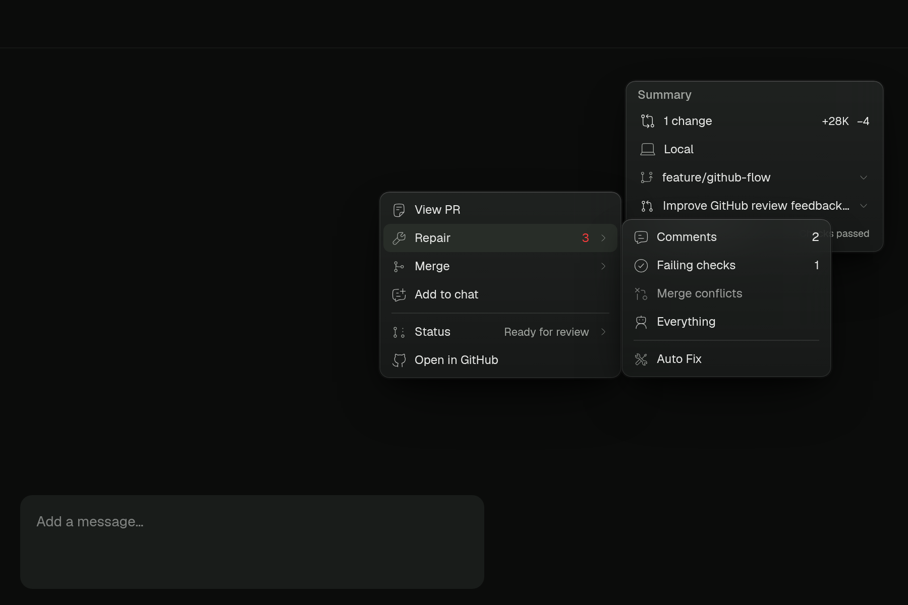
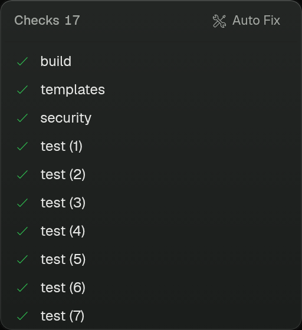

# GitHub summary design

The PR menu uses a compact action hierarchy: View PR, Repair, Merge, Add to chat, Status, and Open in GitHub. Changes stay in the summary's top-level row. Auto Fix belongs inside Repair and in the checks header.

## Density and alignment

- Action and submenu rows: 28px height, 12px labels, 15px Hugeicons.
- Secondary status text: 11px; menu dividers: 1px with equal horizontal insets.
- Checks: 24px rows, a 240px scrolling list, and a 280px maximum popup height for a long list.
- Check status is conveyed by its icon and accessible label. The whole row opens the check URL.
- A stack summary row appears only after discovering that the current branch belongs to a stack. Stack actions in the branch menu are also hidden unless the current branch belongs to a stack. Discovery is shared and cached between both surfaces.

## Loading

Core check names, status, and links are returned with the existing PR summary request. Opening the checks preview does not wait for review bodies, avatar lookups, or workflow-job enrichment. Cached rows stay visible during refresh. The shared dotted spinner indicates pending checks. The header, summary, and PR view share one resource-backed check state, including the details fallback for older servers. Summary counts derive from the displayed check runs, and terminal conclusions take precedence over stale running statuses.

## Browser verification

These captures use the actual renderer components with fixture PR data at 2× device scale. They are not native macOS end-to-end captures.

Verified equal row/icon sizes, submenu navigation, all 17 checks reachable by scrolling, and Auto Fix state shared between Repair and the checks header. Automated tests cover missing-stack caching, stack creation becoming visible, branch isolation, pending-probe races, and checks available before enrichment.

Summary menus are non-modal: a branch or location popup cannot put an invisible input-blocking layer over the PR trigger. Browser verification includes opening Branch, hovering PR, and opening PR in one click, plus returning from a nested Repair submenu.

## Manual repair handoff

Repair scopes and the PR menu's Add to chat action stage removable context pills above the composer. They do not send messages, change the editor text, save files, or wait for GitHub/network requests. Hovering or focusing a pill shows full feedback in a bounded, scrollable glass preview. Repeated selections replace the same scope. The next explicit Send carries context as structured annotations, keeping the visible message text unchanged while the provider receives full feedback; unsuccessful delivery retains the context, and successful delivery clears only the submitted rows. Auto Fix remains the separate automatic workflow.

Browser verification exercises PR → Repair → Comments, confirms the full feedback appears in the tray without changing extra instructions, and reopens the PR menu afterward. The fixture uses the actual menu and context tray with a simple text field; submission and failure handling are covered by unit tests.

## Glass and handoff feedback

The summary and GitHub popups share `bg-glass` and `border-glass`: in dark mode, a 72% translucent surface with 20px backdrop blur. Staging context shows a success toast, and the summary suppresses accidental checks previews until the pointer moves again.

Sent messages show context and annotation pills above the message bubble. File, skill, and attachment chips use the same compact height and rounded surface. Context-only messages do not render an empty bubble. Existing messages that already stored feedback as plain text retain their original text.

The shared check-state merge reconstructs `GitPrCheckRun` instances after combining core status with detailed metadata. Spreading these into plain objects loses schema identity; checks containing decoded `Date` fields then fail nested validation when opening the PR. A regression test covers this conversion with completed workflow timestamps.

GitHub avatars use the shared avatar loading/failure fallback and the URL supplied by GitHub. The shared default shape is a squircle; initials stay visible while artwork loads or when it cannot be loaded.

Annotations and PR context share one wrapping attachment row inside the composer's attached tray. The row renders nothing when both sources are empty. The browser annotation toolbar and comment editor use 28px controls, 12px labels, 14px icons, and compact glass surfaces; the comment editor is capped at 344px wide.

Feedback cards in Changes navigate on click or keyboard activation: inline comments open their file and line through the existing Changes navigation, while PR-wide summaries open the original GitHub thread. Text selection, nested links/buttons, and expandable summaries do not activate the card. The PR overview's inline file/line labels also open Changes.

## Review follow-up

The stack includes the latest main branch while preserving cloud mailbox queue delivery and structured composer attachments. Provider check links accept only HTTP(S), including the disabled UI state. Stack discovery caches only expected absence, preserves known results on transient errors, and retries discovery while mounted. Startup failures share the failed-check classification used by summary counts and log collection; terminal conclusions take precedence in the watcher.

Plan-feedback submissions retain the draft until delivery is accepted, including native-plan fallback sends. Review attachments preserve their source URL, and the PR view retains summary checks while details are unavailable. Annotation edit actions are visible during keyboard focus. Manual Repair deliberately stays available during active turns because it only stages draft context; the unused parent busy prop was removed.
