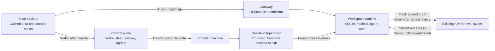
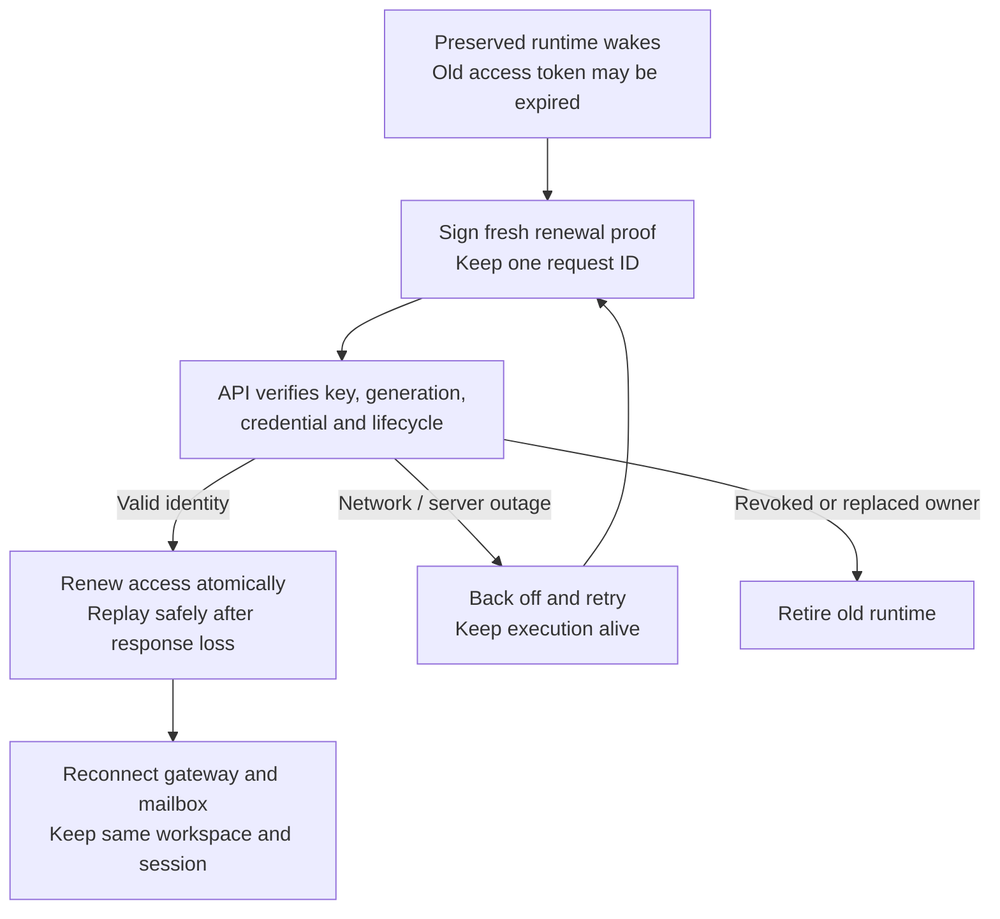

# Cloud runtime foundation

Status: foundation design with the signed credential renewal portion implemented
in this workspace; not deployed. User selected automatic idle sleep with seamless wake.

## Product requirement

A cloud conversation behaves like a durable remote computer. Closing Zuse,
changing networks, gateway replacement, and short control-plane outages do not
stop accepted agent work. Returning to a conversation attaches to the same work.
Users should not need Retry to recover from ordinary transport changes.

No distributed system can eliminate machine failures. The design must prevent
a lost connection from becoming an execution failure and contain actual process
failures at their smallest owner. Sleep is a deliberate compute policy, not an
error. Deletion and access revocation remain explicit and authoritative.

## Evidence and limits

On October 9, 2026, Kadabra (`workspace_bCyAzJ7Zy0eQHkfG`) had:

- API state `failed`, status `runtime-connection-timeout`, generation 29;
- last runtime logs from generation 28 reporting `workspace_runtime_rejected`;
- no running Zuse runtime or loaded tagged runtime unit during guest inspection;
- a responsive guest with approximately 7.5 GiB available memory and `oom_kill 0`;
- an existing Boxd machine, hibernated before the guest probe;
- no `runtimeLaunchRecoveryAttempts` in its persisted configuration.

Chansey was independently observed online with its agent running after a
57-second startup. These observations do not establish the cause or frequency
of all reported daily disconnects, or the exact point at which Kadabra's
replacement launch failed. The deployed API version remains unverified.

Current implementation seams explain how this incident can strand a chat:

- `infra/api/src/cloud-workspace-reconciler.ts` saves a new generation and clears
  the current credential before calling `provider.replaceProcess`. Authorization
  and process launch are separate operations.
- `packages/sandbox-providers/src/box-process.ts` launches transient tagged units
  with `Restart=no`: a single-use boot token makes arbitrary process restart unsafe.
- `apps/renderer/src/lib/cloud-workspaces.ts` can escalate attachment trouble into
  `resume({ recoverRuntime: true })`. Current API code verifies some live runtimes
  first, but transport attachment still has access to execution recovery.
- `packages/client-runtime/src/environment-runtime.ts` bounds retries partly to
  avoid endlessly waking billable machines. Reattachment and compute wake must
  have separate budgets before transport retries can safely persist.
- Startup timeout can set `nextActionAtMs` to `Number.MAX_SAFE_INTEGER`. Main's
  #812 adds two retries for interrupted replacement launches; this is useful
  containment, not independent ownership of runtime liveness.

The durable foundations already exist: SessionDomain/SQLite authority, stable
command IDs, the encrypted WorkspaceMailbox, cursor catch-up, one retained
EnvironmentRuntime, and provider adapters. Preserve and deepen these modules.

## Implemented authentication boundary

The existing renewal protocol now separates short-lived access expiry from the
identity of a preserved runtime. This is narrower than persistent machine
enrollment: the signing key still belongs to the current runtime process.

- The API accepts renewal after access expiry only when a fresh proof verifies
  against the registered signing key. Ordinary runtime requests still require
  unexpired access. Unsigned legacy renewal still requires unexpired access.
- The memory and PostgreSQL stores share one renewal decision. The database
  transaction rechecks the signing-key binding, generation, gateway epoch,
  current credential hash, lifecycle, and receipt before rotation or replay.
  Cached receipts cannot resurrect replaced, revoked, archived, or deleted owners.
- Renewal retries keep the same request ID and create a fresh signed proof each
  time. Response loss is recoverable even if the returned access token expired
  while the runtime slept. Transport errors, server errors, rate limits, and
  request timeouts retry with the existing capped exponential schedule.
- Mailbox polling does not terminate execution merely because access expired
  while signed renewal is pending. Explicit fencing still retires the old owner.
  Gateway authorization expiry is a reconnect condition.

Regression tests exercise the real renewal route with cryptographic signatures,
real PostgreSQL row locks with concurrent requests, and the runtime renewal seam
across a simulated two-day outage. They preserve workspace/session/generation
identity and reject invalid proofs and stale receipt replay.

Rollout must update the API first, then the runtime artifact. Older runtimes keep
their expiry-triggered termination behavior until upgraded. No schema migration
or sandbox/database replacement is required for this change. Production incident
frequency and a provider sleep/wake soak remain unverified.

The resident supervisor, durable identity across process death/cold boot,
attachment-only client retries, resource containment, and transactional upgrades
below remain proposed work. This change alone does not prove the full product
requirement or eliminate every cause of connection failure.

## System diagram

Target ownership; the resident supervisor and separation of client recovery from
execution replacement are still proposed. Signed renewal is implemented locally.

Implemented sleep/outage authentication path:

## Ownership

| Module | Owns | Does not infer |
| --- | --- | --- |
| ClientBus / EnvironmentRuntime | Cached resources, attachment, catch-up, transport retry | A broken socket means the agent died |
| API lifecycle reconciler | Desired compute state, entitlement, revocation, placement, update intent | Missing client presence means execution failed |
| Guest supervisor | Runtime process liveness, local health, installed releases, fenced activation | Gateway outage requires process replacement |
| Workspace runtime | SessionDomain, durable command acceptance, provider execution, resource interfaces | Credential rotation requires a new execution instance |
| Provider adapter | Native machine state, disk readiness, wake, sleep, metadata | Provider running means runtime ready |

The supervisor should be a small module within `apps/server`, integrated through
the existing provider adapters. Do not introduce another cloud orchestration
registry or a second authority for session state.

## Proposed execution model

### A resident supervisor starts independently of the desktop

Install a boot-enabled supervisor in the guest. Systemd owns this small process
with bounded restart rate and backoff; the supervisor owns runtime children and
keeps a local activation journal. An installed runtime can start after a cold
boot without a new desktop request or a newly injected one-time boot token.

Enrollment exchanges the one-time token for a persisted, workspace-bound machine
identity. Short-lived credentials are renewed with proof of possession. Reuse
and extend the existing signing/renewal mechanisms rather than adding a second
credential protocol. The identity is revocable, excluded from reusable images,
and cleared or quarantined in forks. It cannot allocate compute, cross workspace
boundaries, or bypass the lifecycle fence. This changes enrollment and requires
a security review and explicit protocol design before implementation.

Offline identity verification may permit continuation of an already accepted
turn within an agreed authorization window. It must not permit new unauthorized
commands indefinitely. Expiry, revocation, clock behavior, and outage handling
must be specified together; availability must not silently remove authorization.

### Process identity, credentials, and connections have different lifetimes

Current code has a concrete expiry coupling: runtime credentials have a
15-minute TTL (`cloud-workspace-routes.ts`) and renew at half-life. The runtime's
renewal function fails before making a request if the credential has expired;
`superviseRuntimeCredential` then sends its own process SIGTERM. The API store
also rejects renewal after the stored expiry. A sleep longer than the remaining
TTL therefore leaves a preserved process unable to renew through this interface.
This is a code-path finding, not proof of the cause of every production outage.

The new authentication interface must separate three principals:

| Principal | Identity owner | Effect of renewal/expiry |
| --- | --- | --- |
| Signed-in user | Existing account/session module | Renew desktop access; require sign-in only when refresh actually fails |
| Workspace machine | Guest supervisor and registered workspace identity | Obtain fresh runtime access without replacing execution |
| Model account | Existing account credential broker | Renew provider access; affect the relevant provider operation |

One module owns workspace authentication. Other callers obtain current access
through its interface instead of keeping token copies, checking expiry, or
implementing their own reauthentication loops. Existing broker modules retain
their own principal; do not combine user, machine, and model credentials into
one token or give one principal another's authority.

The supervisor opens or renews a short-lived runtime session using its persisted
private key and a fresh server challenge. The server checks the registered key,
workspace/storage binding, current execution owner, and revocation. Possession
of an unexpired prior bearer is not required to authenticate the same authorized
machine after sleep. Challenges are short-lived and single-use, and session
creation is idempotent across a lost response. Existing renewal proof/receipt
code should be evaluated for extension before designing another mechanism.

An expired access credential closes or suspends unauthorized network operations;
it does not by itself kill the runtime or change execution ownership. On wake,
authenticate once and attach with fresh access. Explicit revocation or a confirmed
ownership fence is a different result and prevents further execution by the old
owner. Authorization for already accepted offline work still follows the bounded
policy described above; token expiry cannot silently authorize indefinite work.

The interface returns typed results: access ready, waiting for reachable authority,
revoked/fenced, or identity invalid. Transport failure is not evidence of
revocation. Only the authentication module owns retry and response-loss handling.
Gateway tickets remain disposable attachment capabilities. Refreshing one does
not replace the machine identity or require restarting an agent.

Keep existing generation fencing until migration is complete. The target model
distinguishes persisted machine/storage identity, execution ownership, credential
revision, and disposable attachment generation. Credential renewal and socket
reattachment do not change execution ownership. Only a deliberate runtime
replacement transfers it.

A durable activation intent records prepare, relinquish, activate, and confirm.
Prepare the local binary and startup inputs while the current runtime still
works. Once ready to transfer, drain or quiesce the old owner, persist its
relinquishment, then authorize the new owner and start it. A journal makes each
step restartable after worker or guest-supervisor interruption.

There is no atomic transaction across Postgres and a guest process. Do not claim
otherwise. A confirmed owner token plus a local single-writer lock and fenced
command leases prevent overlap; prepared replacements cannot execute work.
After transfer failure, restart the previous compatible release under a fresh
authorized owner. Never reactivate an obsolete fence.

### A transport outage only affects transport

Client reconnect reuses the existing EnvironmentRuntime and durable cursor.
It renews tickets and attaches with jittered backoff while the user retains the
resource. It cannot restart execution. A typed terminal auth/revocation or
compatibility response ends attachment; network failures do not.

Keep the mailbox independent of the gateway, as the current runtime already
intends. Buffered output must have bounded memory/disk use and retain the
existing durable transcript path. Live terminal output uses its own sequence and
gap semantics; do not turn gateway frames into a second transcript log.

Wake has a separate, single-flight interface driven by explicit work demand and
desired compute policy. Passive attachment retry never wakes sleeping compute.
This permits persistent transport retry without unlimited idle billing.

### Normal wake does very little

For preserved-process hibernation, wake the same machine and reattach. Do not
rotate execution ownership merely because its connections were lost. For a cold
boot, the supervisor starts the installed compatible release from the journal.
Neither path downloads software, fetches Git, or reinitializes a database.

Keep compute warm during active work and interactive tools. An open desktop or
passive transcript view does not keep idle compute running. Provider idle timers
and API idle decisions must derive from
one policy and reconcile observed native state. A preserved memory image should
not immediately be interpreted as a dead runtime because its first heartbeat
has not arrived yet.

The selected product policy is automatic idle sleep with seamless wake. Explicit
work demand wakes compute once; passive attachment does not. Idle quiescence must
check accepted queued work and active execution before sleeping, including sends
that race the pause transition. Preserve their command IDs and deliver them after
wake. Arbitrary background processes need an explicit compute lease rather than
an assumption that desktop presence keeps them alive.

### Heavy work cannot casually kill runtime control

Apply separate cgroup budgets to the supervisor, runtime, and managed agent/tool
process trees where supported. Reserve measured headroom for control and durable
state; bound build/test concurrency using actual machine resources. Benchmark
CPU, memory, and storage overhead before choosing defaults.

External tools can escape ordinary process-tree accounting. Verify containment
on each provider and surface unsupported isolation rather than assuming it.
Resource limits contain failure but cannot make an undersized VM complete every
workload. Do not resize or increase paid compute silently.

Separating agent execution from runtime replacement is a further execution seam,
not an automatic benefit of adding systemd. Audit each existing provider driver's
reattachment guarantees first. A later durable execution adapter may own agent
stdio and spool sequenced output across runtime replacement. It must reuse the
agents kernel and SessionDomain receipt semantics, with bounded storage and
backpressure. Never replay a tool or prompt whose external side effect is uncertain.
Until a driver passes this contract, report interruption honestly.

### Upgrades are scheduled transactions

Stage and verify signed releases outside normal wake. Keep a verified previous
release. Switch only at a safe execution point; confirm local database identity,
readiness, mailbox access, and client compatibility. Roll back through the same
fenced activation journal if confirmation fails.

This implements ADR 0002's transactional update intent. The resident identity and
supervisor change its startup assumptions and need an amendment before rollout.
No change may replace an existing sandbox or select a new empty SQLite database.

## User-visible behavior

Cached chat remains visible. Accepted mailbox sends show queued, accepted, or
running independently of the live socket. Brief reconnects do not show a failure
banner. Longer attachment outages show a quiet reconnecting state. Actual auth,
compute, disk, or execution problems show their specific cause and action.

Do not hide unavailable interactive tools or claim an unacknowledged send ran.
Successful attachment is not proof the queued command was accepted or the agent
is progressing. Measure and present those states independently.

## Verification and rollout

Proposed engineering gates, to calibrate with measured baselines:

- Client network loss, desktop exit, and gateway recycle cause zero runtime
  replacements and zero duplicate command acceptance in controlled tests.
- Under a healthy guest and reachable control plane, attachment p95 <2 seconds
  after connectivity returns; warm wake p95 <5 seconds.
- Supervisor restart and interrupted activation converge automatically without
  replacing the sandbox, SQLite incarnation, chat, or original command IDs.
- A 72-hour soak per supported provider exercises repeated sleep/wake, gateway
  recycle, client offline intervals, token renewal response loss, duplicate wake,
  process kills, interrupted updates, disk pressure, and constrained memory.
- Every test verifies the original conversation and meaningful agent/tool output,
  not just metadata, SSH reachability, or a green connection icon.

Implement in reviewable stages:

1. Record per-workspace attachment loss, restart reason, owner transfer, process
   exit, startup acknowledgment, and deployed artifact identity. Add failure
   injection at the real launch/credential seams. Establish incident frequency.
2. Remove execution restart authority from transport attachment. Separate wake
   budget from reconnect retry in shared modules; exercise client and gateway loss.
3. Implement resident identity and guest supervision for one provider behind a
   capability flag. Prove boot, revocation, fork identity quarantine, crash, and
   interrupted owner transfer on a populated existing workspace.
4. Move explicit updates to transactional activation; add measured resource
   containment. Audit agent reattachment as a separate capability.
5. Canary real conversations and pass the soak before expanding by provider.

Each stage deletes the superseded mechanism once its callers migrate. Do not
stack another retry controller over the current ones. Older workspaces keep
their current startup interface until individually migrated and verified.

Observability must distinguish expected sleep, transport detach, authorization,
process exit, provider unavailability, and an owner transfer. Preserve the reason
through the API and UI. Deployment gates check the actual running API/runtime
versions, not merely that fixes merged or a build workflow passed.

## Decisions still requiring evidence

- Actual production API version and historical breakdown of daily failures.
- Available credential-renewal mechanisms that can safely persist machine identity.
- Which agent drivers can reattach without duplicate external effects.
- Provider cgroup and boot-supervisor guarantees under hibernation and cold boot.
- Idle timeout and wake reliability targets, with measured cost and latency.

These questions constrain implementation; they do not change the central rule:
ordinary network churn must never become a request to replace execution.
